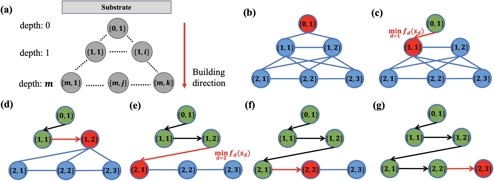

# **Welcome to my homepage**
I am a final year Ph.D. Candidate from The Chinese University of Hong Kong ([CUHK](https://www.cuhk.edu.hk/english/index.html)), supervised by Professor [Wei-Hsin Liao](https://www4.mae.cuhk.edu.hk/peoples/liao-wei-hsin/). My research mainly focuses on toolpath generation and optimization algorithms for additive manufacturing. 

I will continue with my postdoctoral research after graduation. 

 

### **Research Interests:**
-  Toolpath generation and optimization algorithms  
-  Deep reinforcement learning-based toolpath optimization  
-  Multi-axis robotics-based additive manufacturing  

 

### **News:** 

##### - *[07/2022]* [One paper](https://doi.org/10.1016/j.jmapro.2022.07.024) regarding  multi-axis printing algorithms  has been published. 
##### - *[06/2022]* I have passed the  oral defense  of my Ph.D. degree!   

 

### **Recent Publications:**  

**Adaptive toolpath generation for distortion reduction in laser powder bed fusion process**    
**<u>Mian Qin</u>**, Shuo Qu, Junhao Ding, Xu Song, Shiming Gao, Charlie C. L. Wang, and Wei-Hsin Liao  
*[Additive Manufacturing](https://www.sciencedirect.com/journal/additive-manufacturing)*, (under 3rd review), 2022. *(TOP, IF = 11.6)*   

---

**[Multi-axis direct metal deposition process with effective regrouping strategy](https://doi.org/10.1016/j.jmapro.2022.07.024)**     
**<u>Mian Qin</u>**, Shiming Gao, Charlie C. L. Wang, and Wei-Hsin Liao    
*[Journal of Manufacturing Processes](https://www.sciencedirect.com/journal/journal-of-manufacturing-processes)*, 2022, 81: 707-716. *(IF = 5.7)* 
 
    
  

 

### **Awards:**
- Teaching Assistant: Faculty Outstanding Tutor Award (2021) 

 

### **Programming Languages:**
- [Python](https://docs.python.org/3.10/tutorial/index.html)   
- [C++](http://isocpp.github.io/CppCoreGuidelines/CppCoreGuidelines#c-core-guidelines)

