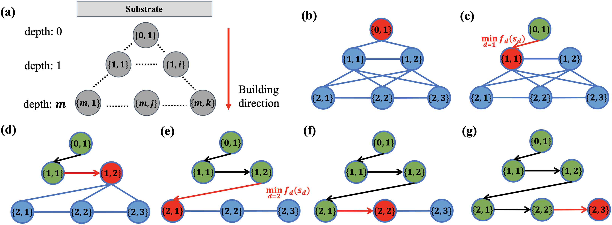

# Recent Publications [(full list)](https://scholar.google.com/citations?user=Vt3yXJkaAWAC&hl=zh-CN&oi=ao)   
---

##### Adaptive toolpath generation for distortion reduction in laser powder bed fusion process
**<u>Mian Qin</u>**, Shuo Qu, Junhao Ding, Xu Song, Shiming Gao, Charlie C. L. Wang, and Wei-Hsin Liao
*Additive Manufacturing*, (under 2nd review), 2022

 
 

    

##### <u>Mian Qin</u>, Shiming Gao, Charlie C. L. Wang, and Wei-Hsin Liao, ["Multi-axis direct metal deposition process with effective regrouping strategy,"](https://doi.org/10.1016/j.jmapro.2022.07.024) *Journal of Manufacturing Processes*, 2022, 81: 707-716.

   

 
 
[back](./)
